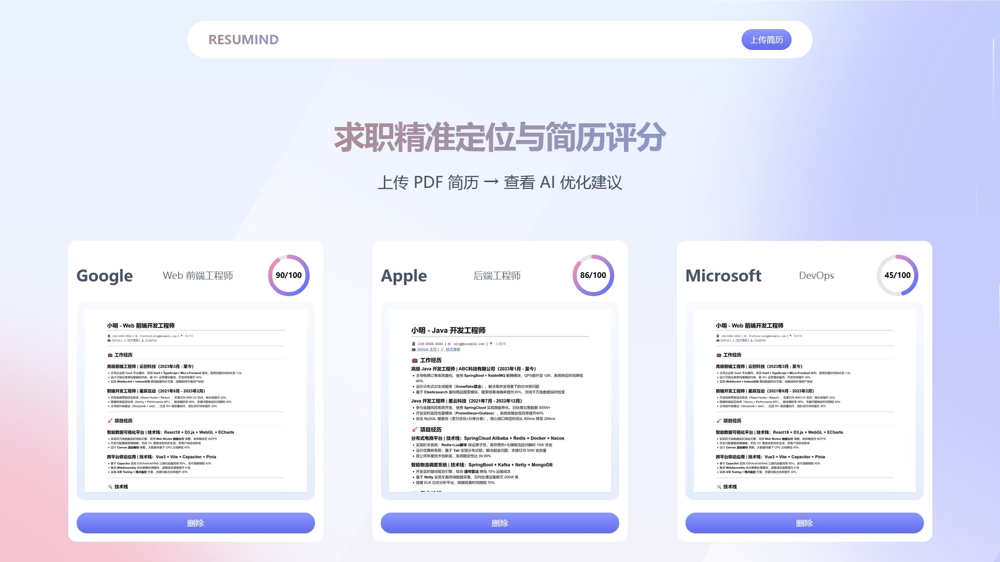
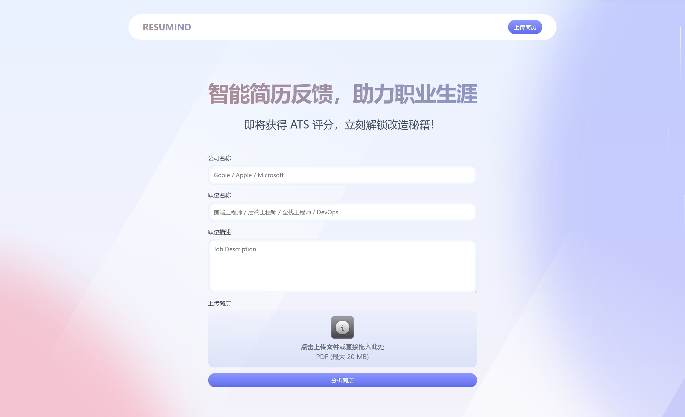
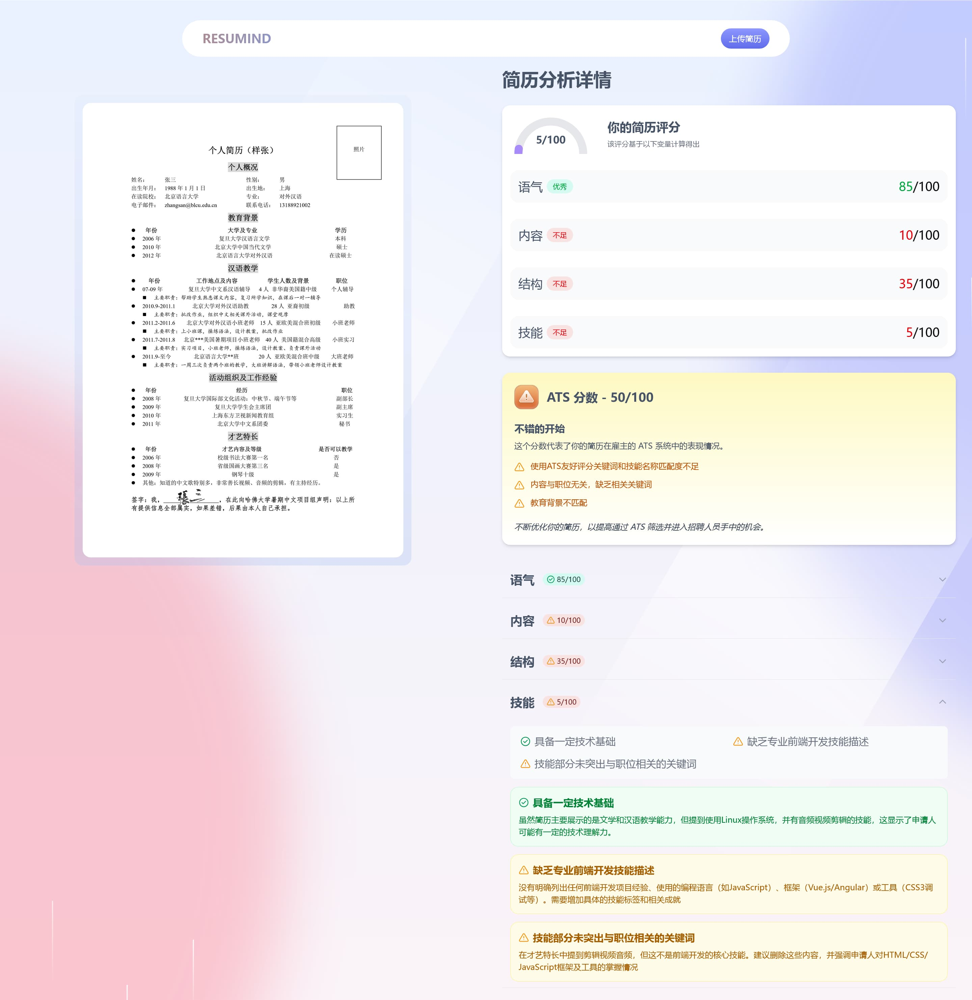

# Resumind - AI 简历智能分析平台

_Resumind_ 是一个现代化的 AI 简历分析平台，利用大型语言模型（LLM）技术智能评估简历与职位描述的匹配程度，为求职者提供 ATS 评分以及专业、个性化的改进建议。

## 核心优势

| 功能特性                  | 用户价值                                     |
| ------------------------- | -------------------------------------------- |
| **隐私优先架构**          | 所有数据仅在本地存储，无需再担心个人信息泄漏 |
| **精准匹配分析**          | 深度解析简历与职位描述的契合度，提供量化评分 |
| **智能优化建议**          | 针对每个职位生成定制化的简历改进方案         |
| **现代响应式设计**        | 简洁美观的 UI，响应式布局适配所有设备        |
| **OpenAI-Compatible API** | 兼容任何 OpenAI API 标准的本地/云端 LLM 模型 |

## 在线体验

[https://resumind-taupe.vercel.app](https://resumind-taupe.vercel.app)

_Demo 实例受成本限制，目前无法稳定提供服务。如果这个项目对你有价值，欢迎[为我充电](https://space.bilibili.com/281356255)！_

## 技术栈

- Next.js
- Tailwind CSS
- TypeScript

## 快速开始

按照以下步骤在本地机器上设置项目：

### 前置条件

本地运行兼容 OpenAI API 的 LLM 推理，下面以 `llama.cpp` 为例：

```bash
./llama-server -fa -m models/DeepSeek-R1-0528-Qwen3-8B-Q4_K_M.gguf
```

参数量太小的模型可能无法得到良好的结果，建议 8B 及以上

### 克隆代码仓库

```bash
git clone https://github.com/jerryshell/resumind.git
cd resumind
```

### 安装

使用 npm 安装项目依赖：

```bash
npm install --legacy-peer-deps
```

_为什么要使用 `--legacy-peer-deps`？这是 OpenAI 上游解决 Zod 4 冲突之前的绕过方法：<https://github.com/openai/openai-node/issues/1576>_

### 配置 LLM API

在项目根目录下创建一个 `.env.local` 文件，并添加以下内容：

```env
# LLM API
NEXT_LLM_BASE_URL="http://localhost:8080/v1"

# API 密钥
NEXT_LLM_API_KEY=""

# 模型名称
NEXT_LLM_MODEL="models/DeepSeek-R1-0528-Qwen3-8B-Q4_K_M.gguf"
```

### 启动应用

```bash
npm run dev
```

访问 [http://localhost:3000](http://localhost:3000) 开始使用！

## 项目截图

<div align="center">
  
  <p><em>项目主界面 - 清晰展示目标职位和匹配评分</em></p>

  
  <p><em>简历提交界面 - 充分考虑目标职位的要求</em></p>

  
  <p><em>详细分析报告 - 分项评估简历各维度表现</em></p>
</div>

## 开源协议

[GNU Affero General Public License v3.0](LICENSE)
