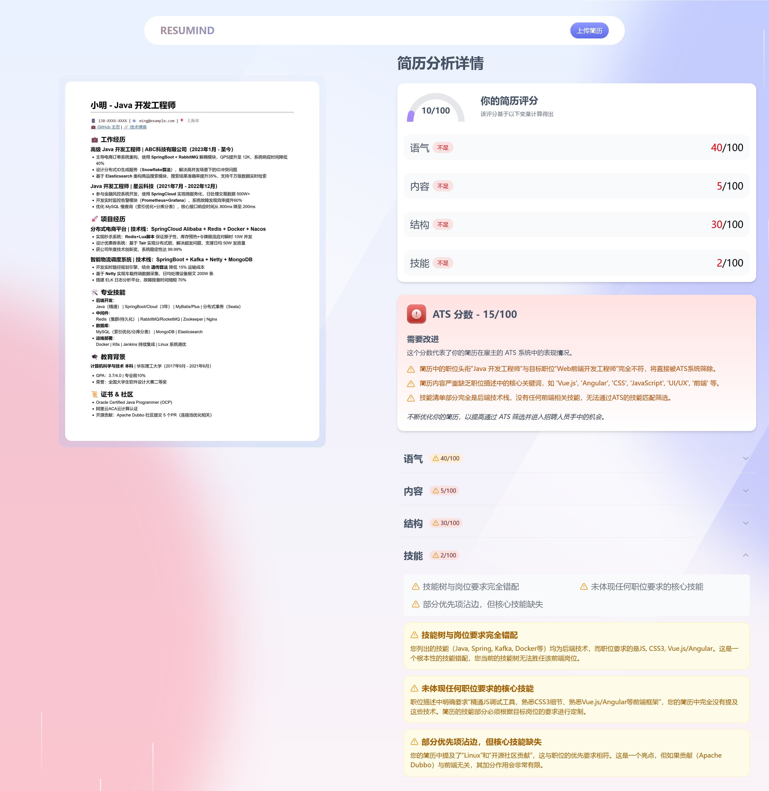

# Resumind - AI 简历分析

_Resumind_ 是一个使用 Next.js + Tailwind CSS 构建的 AI 智能简历分析系统。

使用 OpenAI 兼容接口，本地优先，隐私保护，可以自由选择 LLM 供应，无需再担心个人信息泄漏。

通过智能 AI 评估简历的匹配程度，并且为每个职位定制专属反馈与 ATS 评分。

所有功能都集成在简洁可复用的 UI 界面中。

## 零部署在线体验

[https://resumind-taupe.vercel.app](https://resumind-taupe.vercel.app)

体验 Demo 使用的套餐有成本上限，无法稳定提供服务。

如果这个项目对你有用，欢迎[为我充电](https://space.bilibili.com/281356255)！

## 技术栈

- **[React](https://react.dev/)** 是一个流行的开源 JavaScript 库，通过可复用组件和虚拟 DOM 构建用户界面，能高效创建动态单页应用和原生应用。
- **[Next.js](https://nextjs.org/)** 是基于 React 的服务端渲染框架，提供内置路由、API 端点、静态站点生成和无缝部署功能，为现代 Web 应用优化性能与 SEO。
- **[Tailwind CSS](https://tailwindcss.com/)** 是实用优先的 CSS 框架，开发者可直接在 HTML 中使用底层工具类设计定制化界面，从而简化设计流程。
- **[TypeScript](https://www.typescriptlang.org/)** 是 JavaScript 的超集，通过静态类型增强开发工具支持、代码质量和错误检测能力，特别适合构建大型应用。

## 功能

- **AI 简历匹配**：提交职位描述，即可获取针对每份简历定制的 ATS 评分与专属反馈。
- **本地优先与隐私保护**：所有数据仅在本地存储，无需再担心个人信息泄漏。
- **可复用的组件**：采用简洁一致的组件构建，通过可复用组件和模块化代码打造美观易维护的界面。
- **现代响应式 UI/UX 设计**：基于 Tailwind CSS 构建的清爽响应式界面，在所有设备上提供流畅用户体验。

## 快速开始

按照以下步骤在您的本地机器上设置项目。

**前置条件**

确保本地机器上已运行具有 OpenAI-Compatible API 的大型语言模型，如使用 [LM Studio](https://lmstudio.ai/)、[Ollama](https://ollama.com/) 等工具。

**克隆代码仓库**

```bash
git clone https://github.com/jerryshell/resumind.git
cd resumind
```

**安装**

使用 npm 安装项目依赖：

```bash
npm install
```

**配置 LLM API**

在项目根目录下创建一个 `.env.local` 文件，并添加以下内容：

```
# OpenAI 兼容接口
NEXT_LLM_BASE_URL="http://localhost:1234/v1"
# 接口密钥
NEXT_LLM_API_KEY=""
# 模型名称，参数太小的模型可能无法得到良好的结果，建议 8b 及以上
NEXT_LLM_MODEL="deepseek/deepseek-r1-0528-qwen3-8b"
```

请根据自己的环境进行修改。

**运行项目**

```bash
npm run dev
```

在浏览器中打开 [http://localhost:3000](http://localhost:3000) 查看项目。

## 项目截图




## 开源协议

[GNU Affero General Public License v3.0](LICENSE)
